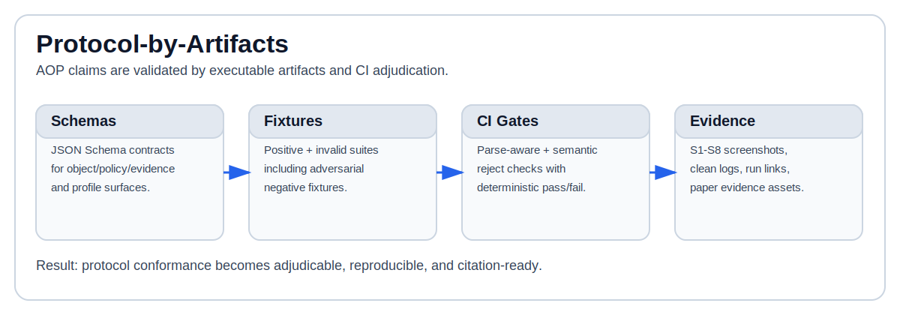

<!-- markdownlint-disable MD013 -->

# Agent Object Protocol (AOP)

[](https://doi.org/10.5281/zenodo.18876796)

> **Status:** Active specification repository
> **Latest Release:** v1.1.0 ([release notes](RELEASE_NOTES_v1.1.0.md))
> **Public API:** Frozen at v1.0.0 ([AEP-0009](aep/aep-0009-v1.0-freeze.md), [V1_PUBLIC_API_CANDIDATE](V1_PUBLIC_API_CANDIDATE.md))
> **Conformance:** Levels 2-8 published; optional Level 9 integration is tracked by [AEP-0011](aep/aep-0011-v1.2-in-toto-statement-compat.md)
> **Scope:** Interoperability artifacts only (schemas + fixtures + CI gates; no reference runtime in this repo)
> **License:** Apache-2.0



**Versioning note:** Repository releases follow SemVer (`v1.x.y`).
Manifest field `aop_version` currently targets pre-v1 payload
generations (`0.x`) in the published schemas. Treat repository release
tags and payload `aop_version` as separate version axes.

Agent Object Protocol (AOP) is an open standard effort for defining
portable executable object contracts for AI agent ecosystems.

AOP emphasizes reproducible interoperability artifacts:

- JSON Schemas as machine-readable contracts
- Positive/negative fixtures as executable examples
- CI gates as adjudicable conformance checks

## Quick Links

- Public API surface: `V1_PUBLIC_API_CANDIDATE.md`
- Conformance profile: `CONFORMANCE.md`
- Core schema families:
  - `schemas/aop-object.schema.json`
  - `schemas/aop-policy.schema.json`
  - `schemas/aop-policy-decision.schema.json`
  - `schemas/aop-evidence.schema.json`
  - `schemas/profiles/*.schema.json`
- Release milestones:
  - `RELEASE_NOTES_v1.0.0.md`
  - `RELEASE_NOTES_v1.1.0.md`

## Paper Evidence

Artifact baseline used for the paper evidence chain:

- Code baseline: [`main@c9f94ee`](https://github.com/joy7758/agent-object-protocol/commit/c9f94ee)
- Evidence assets baseline:
  [`main@41242b1`](https://github.com/joy7758/agent-object-protocol/commit/41242b1)
- CI evidence run:
  [`22717328360`](https://github.com/joy7758/agent-object-protocol/actions/runs/22717328360)
- Figure S8:
  [`docs/paper-evidence/ci/S8_adversarial-gate-summary-ci.png`](docs/paper-evidence/ci/S8_adversarial-gate-summary-ci.png)
- S8 clean log excerpt:
  [`docs/paper-evidence/ci/ci_run_22717328360_job_65870183177.clean.log`](docs/paper-evidence/ci/ci_run_22717328360_job_65870183177.clean.log)

---

## Motivation

Current agent stacks have transport and invocation standards, but often
lack a stable, portable object contract layer for manifest shape,
governance, policy decisions, and evidence binding.

AOP fills this gap by defining interoperable artifacts that can be
validated independently of any specific runtime.

---

## Core Concepts

An AOP object manifest includes:

- `aop_version`
- `id`
- `kind`
- `name`
- `description`
- `schema.inputs`
- `schema.outputs`

Minimal object example (aligned with current schema shape):

```json
{
  "aop_version": "0.9",
  "id": "urn:aop:tool:file-search:v1",
  "kind": "tool",
  "name": "file-search",
  "description": "Search files in a directory",
  "schema": {
    "inputs": {
      "type": "object",
      "properties": {
        "path": { "type": "string" },
        "query": { "type": "string" }
      },
      "required": ["path", "query"],
      "additionalProperties": false
    },
    "outputs": {
      "type": "object",
      "properties": {
        "results": {
          "type": "array",
          "items": { "type": "string" }
        }
      },
      "required": ["results"],
      "additionalProperties": false
    }
  }
}
```

---

## Normative and Non-Normative Sources

For the v1 public API baseline, normative sources are:

- `V1_PUBLIC_API_CANDIDATE.md`
- `schemas/aop-object.schema.json`
- `schemas/aop-policy.schema.json`
- `schemas/aop-policy-decision.schema.json`
- `schemas/aop-evidence.schema.json`
- `schemas/profiles/*.schema.json` included in the v1 candidate surface
- `CONFORMANCE.md` levels and gate semantics

Non-normative but CI-validated interoperability artifacts include:

- `schemas/aop-registry-record.schema.json`
- `schemas/aop-resolve-response.schema.json`
- `examples/**` and `examples/invalid/**`

---

## Quick Start (Validation)

Compile all top-level schemas (Draft 2020-12):

```bash
for schema in schemas/*.schema.json; do
  ajv compile --spec=draft2020 -s "${schema}"
done
```

For fixture-level validation rules (including semantic gates, profile
checks, and positive/negative expectations), use:

- `CONFORMANCE.md`
- `.github/workflows/ci.yml`

---

## Relationship to MCP

AOP is complementary to the Model Context Protocol (MCP):

- MCP focuses on tool transport and invocation channels.
- AOP focuses on object contracts and conformance artifacts.

MCP and AOP are designed to compose, not compete.

---

## Relationship to FAIR Digital Objects

AOP is inspired by FAIR Digital Object principles:

- persistent identifiers
- machine-readable metadata
- interoperability-first semantics

AOP applies these ideas to executable agent object contracts.

---

## Milestones and History

- v0.5 baseline release:
  - `RELEASE_NOTES_v0.5.0.md`
- v1.0 public API freeze:
  - `RELEASE_NOTES_v1.0.0.md`
  - `aep/aep-0009-v1.0-freeze.md`
- v1.1 DSSE optional profile:
  - `RELEASE_NOTES_v1.1.0.md`
  - `aep/aep-0010-v1.1-dsse-optional-profile.md`
- v1.2 in-toto DSSE compatibility (in progress):
  - `aep/aep-0011-v1.2-in-toto-statement-compat.md`

---

## Status

AOP is actively maintained as a specification repository.

Contributions are welcome through AEP proposals, schema updates,
fixtures, and conformance-gate improvements.

## Citation

Zhang, B. (2026). Agent Object Protocol: Protocol-by-Artifacts for
Machine-Adjudicable AI Artifacts. Zenodo.
[https://doi.org/10.5281/zenodo.18876796](https://doi.org/10.5281/zenodo.18876796)
